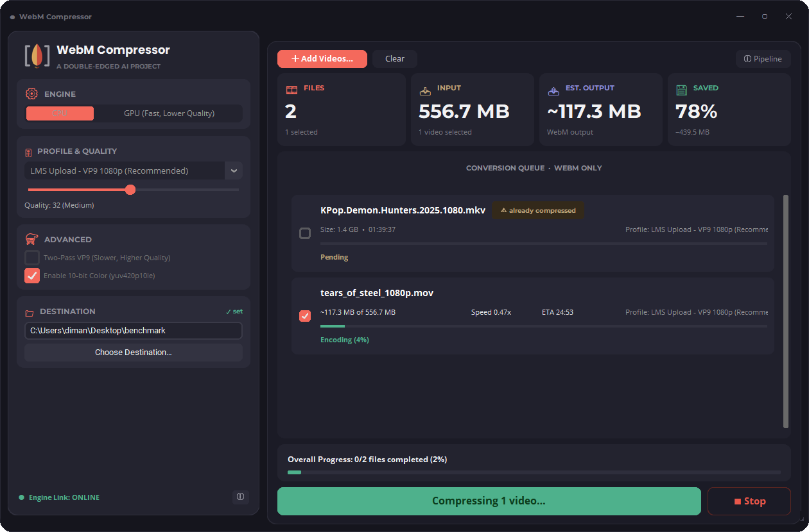

# 🎬 WebM Compressor

⚔️ *A **Double-Edged AI** project*

**WebM Compressor is a Windows desktop app for compressing large educational videos into smaller WebM files for LMS uploads and online course platforms.** It helps course creators, educators, and video editors reduce file size while keeping playback smooth for students on slower internet connections.

**Perfect for:** 🎓 LMS uploads · 📚 online course platforms · 🖥️ screen-recorded lectures · 🌍 students on slow connections


<!--  -->

> ⚠️ **WebM only.** This app exports `.webm` files (VP9/AV1 video, Opus audio) and nothing else. Every finished file is re-verified as valid WebM. If you need MP4 or H.264, use a general-purpose tool like HandBrake; that is not this app's job.

---

## Why this app

Plenty of tools convert video. This one is built around a single, common workflow: a lecture recording is too big to upload, and the students who will watch it do not have fast internet.

- **One format, done properly.** WebM (VP9/AV1) is web-native, royalty-free, and plays in every modern browser, which makes it a good fit for LMS platforms and course sites.
- **Local and private.** Compression runs entirely on your PC. Course material never gets uploaded to a third-party server, and there are no file-size caps or subscriptions.
- **Simple for non-technical users.** Pick a preset, pick a folder, press one button. The presets are tuned for course content: readable screen text, clear voice audio, small files.

Honest note: like most video tools, FFmpeg does the actual encoding under the hood. What this app adds is the workflow: LMS-focused presets, a batch queue with per-file selection, required save location, GPU handling with automatic fallback, and guaranteed WebM output.

## Features

- 🎯 **Compress any input video format to WebM**: MP4, MOV, MKV, AVI and more in, WebM out, always
- 🎓 **LMS-friendly presets**: one-click profiles tuned for course upload, small size, or maximum quality
- 📦 **Large file support, no artificial size limit**: multi-GB lecture recordings are the design target
- 🗂️ **Batch queue with per-video selection**: queue many files, tick which ones to compress, or run just one
- 🖱️ **Drag and drop** videos straight into the window
- ⚡ **CPU/GPU engine choice** with automatic hardware detection and CPU fallback (details below)
- 📁 **Required, respected save location**: output goes exactly where you choose, originals are never touched
- 📊 **Progress everywhere**: per-file bars, ETA, predicted output size, and real Windows taskbar progress
- 👀 **5-second quality preview** before committing to a long encode
- 🎞️ **VP9** (libvpx) and **AV1** (SVT-AV1) with **Opus** audio, optional two-pass VP9 and 10-bit color
- 📥 **FFmpeg auto-download on first run** (official LGPL build), no manual setup

## Output profiles

| Profile | Best for |
|---|---|
| 🎓 **LMS Upload - VP9 1080p (Recommended)** | Course uploads: the size/quality sweet spot for lectures |
| 💎 **High Quality - VP9 1080p** | Maximum visual quality when size matters less |
| ⚖️ **Balanced - VP9 1080p** | Slightly smaller than LMS Upload with similar quality |
| 📉 **Small Size - VP9 720p** | Tight storage quotas; screen text still readable |
| 🐌 **Ultra Small - VP9 720p (Slow Internet)** | Students on very slow connections |
| 🧪 **Experimental AV1 - 1080p (Smallest, Slower)** | Around 20-30% smaller than VP9, but slower to encode |
| 🎙️ **Audio Only - Opus (No Video)** | Podcast or audio-lecture versions of a course |

## GPU acceleration

The app can use your graphics card to speed things up, but full GPU encoding depends on your hardware:

| Your GPU | What you get |
|---|---|
| NVIDIA RTX 40-series or newer | Full hardware AV1 encoding (fastest) |
| Intel Arc, or recent Core iGPU with Quick Sync | Hardware AV1/VP9 encoding |
| AMD Radeon RX 7000 or newer | Hardware AV1 encoding |
| Older GPUs (GTX, RTX 20/30, older AMD/Intel) | Hybrid mode: GPU decodes and scales, CPU encodes |
| No GPU / unsupported | Automatic CPU encoding (always works) |

There is nothing to configure. At startup the app tests your GPU with a real one-frame encode and picks the best available path. If a GPU step fails mid-job, the app retries the file on CPU automatically, so a job never fails because of GPU problems.

**What you need installed:** just a normal, up-to-date graphics driver (GeForce/Adrenalin/Intel Graphics). FFmpeg with the required encoders is downloaded automatically on first run. Select "GPU" in the app to see which mode is active; the ⓘ button in the sidebar shows details.

## Benchmarks

Coming soon: file-size and quality (VMAF) results from real course videos, plus CPU vs GPU speed comparisons. Early real-world result: a 600 MB course video compressed to roughly 150 MB with no visible quality loss at normal viewing.

## Install (users)

1. Download the latest zip from [Releases](https://github.com/Double-Edged-AI/webm-compressor/releases)
2. Unzip and run `WebM_Compressor.exe`
3. Accept the one-time FFmpeg download prompt, pick a save folder, and compress

Requirements: Windows 10/11. A GPU is optional. Linux notes: [README_LINUX.md](README_LINUX.md)

## Run / build from source (developers)

```bash
git clone https://github.com/Double-Edged-AI/webm-compressor
cd webm-compressor
pip install -r requirements.txt
python app.py                # run the app

# Build a distributable:
pip install pyinstaller
pyinstaller WebM_Compressor.spec
```

Notes for builders:
- Do **not** commit or bundle `ffmpeg.exe`/`ffprobe.exe`. They are large, separately licensed, and fetched at first run (LGPL build from [BtbN/FFmpeg-Builds](https://github.com/BtbN/FFmpeg-Builds)).
- The UI fonts (Poppins, Montserrat, Open Sans; all SIL Open Font License) ship in `assets/fonts` and load at runtime, so the app looks the same on machines without them installed.
- Drag and drop uses `tkinterdnd2`; Windows taskbar progress uses `comtypes` (ITaskbarList3). Both are in `requirements.txt`.

## How it works

Input is decoded (on GPU when possible), optionally scaled, then encoded to VP9 or AV1 and muxed into `.webm` in a single pass (or two-pass for VP9). After each file, the app re-checks the container and codecs to guarantee valid WebM output. Color tags are preserved for HDR sources, timestamps are handled safely for variable-framerate recordings, and originals are never overwritten.

## Contributing

Issues and pull requests are welcome. See [CONTRIBUTING.md](CONTRIBUTING.md), including the CLA note.

## License

**PolyForm Noncommercial 1.0.0**: use, modify, and share freely for any non-commercial purpose. Commercial use requires a separate license from the author. See [LICENSE](LICENSE).

This is source-available, not OSI open source: commercial use is restricted. FFmpeg and the codecs it uses are separately licensed; see [THIRD-PARTY-LICENSES](THIRD-PARTY-LICENSES.md).

Copyright © 2026 [Double-Edged AI](https://github.com/Double-Edged-AI)
