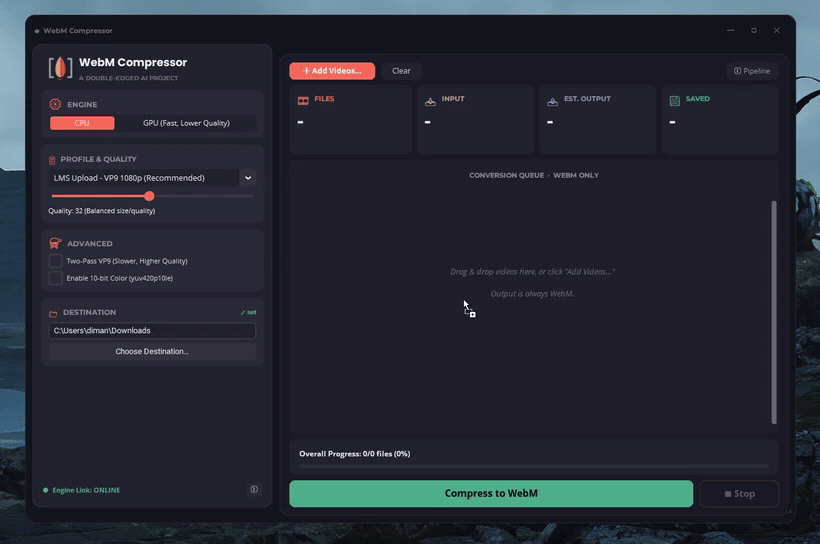
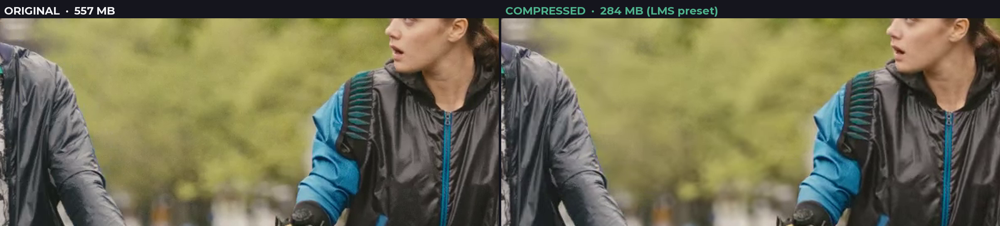
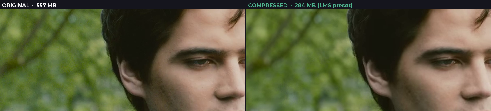
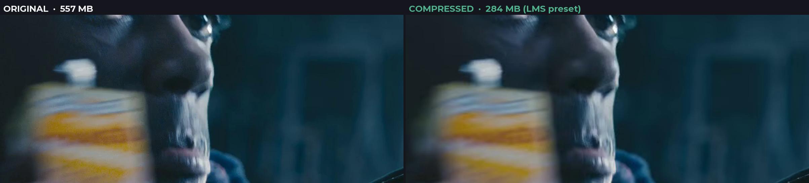
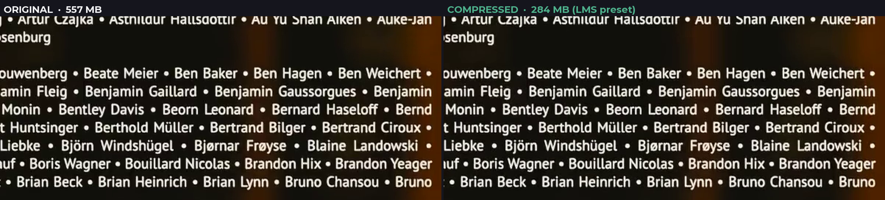

# 🎬 WebM Compressor

⚔️ *A **Double-Edged AI** project*

**Turn large lecture and course videos into small WebM files, right on your PC.**
Pick a preset, pick a folder, and get an upload-ready file. Free for non-commercial use.

Made for: 🎓 LMS uploads · 📚 online courses · 🖥️ screen-recorded lectures




> ⚠️ **WebM only.** This app exports `.webm` files (VP9/AV1 video, Opus audio) and nothing else. Every finished file is re-verified as valid WebM. If you need MP4 or H.264, use a general-purpose tool like HandBrake; that is not this app's job.

---

## Why I built this

A lecture recording is often too big to upload, and the students who need it may not have fast internet. This app exists to fix that one workflow.

Exporting MP4 is easy in almost any editor or converter. WebM is often the harder case: many video editors do not offer it as a simple default, so creating one can mean adding a plugin, running the file through a separate converter, or adjusting manual settings. General tools like HandBrake and Shutter Encoder can produce WebM, but it sits among dozens of other formats and options.

This app does the opposite. It only makes WebM, with presets already set up for course and lecture uploads. Pick a preset, pick a folder, and you get a small, valid file. No plugins, no codec settings.

The encoding itself is done by FFmpeg, like most video tools. What this app adds is the workflow around it: course-ready presets, a batch queue, a fixed save location, automatic GPU use with a CPU fallback, and a WebM validity check on every file. It is fast, too: high-bitrate lecture footage typically shrinks by around 80% with no visible loss (see the [benchmarks](#benchmarks) below).

## Features

- 🎯 **Compress any input video format to WebM**: MP4, MOV, MKV, AVI and more in, WebM out, always
- 🎓 **LMS-friendly presets**: one-click profiles tuned for course upload, small size, or maximum quality
- 📦 **Large file support, no artificial size limit**: multi-GB lecture recordings are the design target
- 🗂️ **Batch queue with per-video selection**: queue many files, tick which ones to compress, or run just one
- 🖱️ **Drag and drop** videos straight into the window
- ⚡ **CPU/GPU engine choice** with automatic hardware detection and CPU fallback (details below)
- 📁 **Required, respected save location**: output goes exactly where you choose, originals are never touched
- 🔒 **Fully offline and private**: nothing is uploaded, no accounts, no telemetry
- 📊 **Progress everywhere**: per-file bars, ETA, predicted output size, and real Windows taskbar progress
- 👀 **5-second quality preview** before committing to a long encode
- 🎞️ **VP9** (libvpx) and **AV1** (SVT-AV1) with **Opus** audio, optional two-pass VP9 and 10-bit color
- 📥 **FFmpeg auto-download on first run** (official LGPL build), no manual setup

## Output profiles

| Profile | Best for |
|---|---|
| 🎓 **LMS Upload - VP9 1080p (Recommended)** | Course uploads: the size/quality sweet spot for lectures |
| 💎 **High Quality - VP9 1080p** | Maximum visual quality when size matters less |
| ⚖️ **Balanced - VP9 1080p** | Slightly smaller than LMS Upload with similar quality |
| 📉 **Small Size - VP9 720p** | Tight storage quotas; screen text still readable |
| 🐌 **Ultra Small - VP9 720p (Slow Internet)** | Students on very slow connections |
| 🧪 **Experimental AV1 - 1080p (Smallest, Slower)** | Around 20-30% smaller than VP9, but slower to encode |
| 🎙️ **Audio Only - Opus (No Video)** | Podcast or audio-lecture versions of a course |

## GPU acceleration

The app can use your graphics card to speed things up, but full GPU encoding depends on your hardware:

| Your GPU | What you get |
|---|---|
| NVIDIA RTX 40-series or newer | Full hardware AV1 encoding (fastest) |
| Intel Arc, or recent Core iGPU with Quick Sync | Hardware AV1/VP9 encoding |
| AMD Radeon RX 7000 or newer | Hardware AV1 encoding |
| Older GPUs (GTX, RTX 20/30, older AMD/Intel) | Hybrid mode: GPU decodes and scales, CPU encodes |
| No GPU / unsupported | Automatic CPU encoding (always works) |

There is nothing to configure. At startup the app tests your GPU with a real one-frame encode and picks the best available path. If a GPU step fails mid-job, the app retries the file on CPU automatically, so a job never fails because of GPU problems.

**What you need installed:** just a normal, up-to-date graphics driver (GeForce/Adrenalin/Intel Graphics). FFmpeg with the required encoders is downloaded automatically on first run. Select "GPU" in the app to see which mode is active; the ⓘ button in the sidebar shows details.

## Benchmarks

Quality was measured with FFmpeg's libvmaf. **VMAF** is the perceptual quality metric developed by Netflix: it compares the compressed video to the original frame by frame and predicts how similar they look to a human viewer, on a 0-100 scale. A score around 95 or above is generally considered indistinguishable at normal viewing. SSIM and PSNR were also recorded. The 720p outputs are upscaled back to source resolution before scoring, which is the standard method and slightly penalizes them.

Two test sources were used: a typical high-bitrate lecture recording, and the open movie **Tears of Steel** ((CC) Blender Foundation, mango.blender.org). The film is a deliberately hard case: grainy cinematic footage with dark scenes, already compressed to 6.4 Mbps, so there is much less left to squeeze. It is also freely downloadable, so anyone can reproduce these numbers with the same file.

| Source | Preset | Original | Output | Saved | VMAF | Encode time* |
|---|---|---|---|---|---|---|
| Lecture recording (1080p H.264, 14.8 Mbps, 6 min) | LMS Upload 1080p | 662 MB | **134 MB** | **80%** | **94.8** | 13 min |
| Lecture recording | Small Size 720p | 662 MB | 50 MB | 92% | 85.3 | 6 min |
| Tears of Steel (1080p film, pre-compressed, 12 min) | LMS Upload 1080p | 557 MB | 284 MB | 49% | 73.9 | 25 min |
| Tears of Steel | Small Size 720p | 557 MB | 95 MB | 83% | 66.2 | 13 min |

\* CPU encoding on an AMD Ryzen 7 3700X, using each preset's default settings.

The pattern to expect: high-bitrate course footage (screen recordings, lecture cameras) compresses dramatically with no visible loss. Sources that are already heavily compressed shrink less, which is normal for any encoder.

**Can you see the difference?** Frames from the Tears of Steel LMS Upload encode, cropped at 2x zoom:

Faces and fine clothing detail:



Skin and hair:



Shallow-focus close-up:



End credits, the hardest test, small text stays readable:



## How it compares

HandBrake and Shutter Encoder are excellent, more powerful, general-purpose tools. This table is not about being better than them. It is about being narrower: WebM Compressor is built for one job, a small and valid WebM for a course or LMS upload, with nothing to configure.

| | WebM Compressor | HandBrake | Shutter Encoder | Boram |
|---|---|---|---|---|
| WebM / VP9 / AV1 as the only job | ✅ | one of many options | one of many options | ✅ |
| Presets tuned for lecture / LMS upload | ✅ | generic | generic | built for short clips |
| Auto-checks every output is valid WebM | ✅ | not built in | not built in | not built in |
| Built for multi-GB lecture files | ✅ | ✅ | ✅ | short clips |
| Fully offline, no upload, no telemetry | ✅ | ✅ | ✅ | ✅ |
| Actively maintained (2026) | ✅ | ✅ | ✅ | inactive for years |

If you need MP4/H.265, editing, or device presets, HandBrake or Shutter Encoder are the right tools. If you just need a lecture turned into a small, valid WebM without learning codec settings, that is what this app is for.

## Install (users)

1. Download the latest zip from [Releases](https://github.com/Double-Edged-AI/webm-compressor/releases)
2. Unzip and run `WebM_Compressor.exe`
3. Accept the one-time FFmpeg download prompt, pick a save folder, and compress

Requirements: Windows 10/11. A GPU is optional. Linux notes: [README_LINUX.md](README_LINUX.md)

## Run / build from source (developers)

```bash
git clone https://github.com/Double-Edged-AI/webm-compressor
cd webm-compressor
pip install -r requirements.txt
python app.py                # run the app

# Build a distributable:
pip install pyinstaller
pyinstaller WebM_Compressor.spec
```

Notes for builders:
- Do **not** commit or bundle `ffmpeg.exe`/`ffprobe.exe`. They are large, separately licensed, and fetched at first run (LGPL build from [BtbN/FFmpeg-Builds](https://github.com/BtbN/FFmpeg-Builds)).
- The UI fonts (Poppins, Montserrat, Open Sans; all SIL Open Font License) ship in `assets/fonts` and load at runtime, so the app looks the same on machines without them installed.
- Drag and drop uses `tkinterdnd2`; Windows taskbar progress uses `comtypes` (ITaskbarList3). Both are in `requirements.txt`.

## How it works

Input is decoded (on GPU when possible), optionally scaled, then encoded to VP9 or AV1 and muxed into `.webm` in a single pass (or two-pass for VP9). After each file, the app re-checks the container and codecs to guarantee valid WebM output. Color tags are preserved for HDR sources, timestamps are handled safely for variable-framerate recordings, and originals are never overwritten.

## FAQ

**Why only WebM? Why not MP4?**
MP4/H.264/H.265 carry patent and licensing baggage, and every other tool already does them well. WebM (VP9/AV1/Opus) is royalty-free, plays in every modern browser, and is ideal for LMS and course sites. Doing one format is what lets the presets be genuinely tuned instead of generic. Need MP4? Use HandBrake.

**Is my video uploaded anywhere?**
No. Everything runs on your PC. No server, no size caps, no accounts, no telemetry.

**Why is AV1 so slow?**
AV1 is newer and more efficient, but far more compute-heavy to encode. It makes files around 20-30% smaller than VP9 at the cost of much longer encode time. For most course uploads the VP9 *LMS Upload* preset is the better trade.

**Windows shows a "Windows protected your PC" / SmartScreen warning. Is it safe?**
That warning appears for any app without an expensive code-signing certificate; it is not a sign anything is wrong. Click **More info → Run anyway**. The full source is public if you want to inspect or build it yourself.

**Do I need to install FFmpeg myself?**
No. On first run the app downloads the official LGPL FFmpeg build automatically.

**Do I need a powerful GPU?**
No. A recent GPU speeds things up, but the app always falls back to CPU encoding, which works on any machine.

**Can I use it commercially?**
The license is PolyForm Noncommercial: free for any non-commercial use. Commercial use needs a separate license from the author.

## Contributing

Issues and pull requests are welcome. See [CONTRIBUTING.md](CONTRIBUTING.md), including the CLA note. See the [Roadmap](ROADMAP.md) for what's planned and the [Changelog](CHANGELOG.md) for release history.

## License

**PolyForm Noncommercial 1.0.0**: use, modify, and share freely for any non-commercial purpose. Commercial use requires a separate license from the author. See [LICENSE](LICENSE).

This is source-available, not OSI open source: commercial use is restricted. FFmpeg and the codecs it uses are separately licensed; see [THIRD-PARTY-LICENSES](THIRD-PARTY-LICENSES.md).

Copyright © 2026 [Double-Edged AI](https://github.com/Double-Edged-AI)
